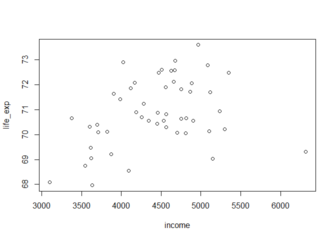
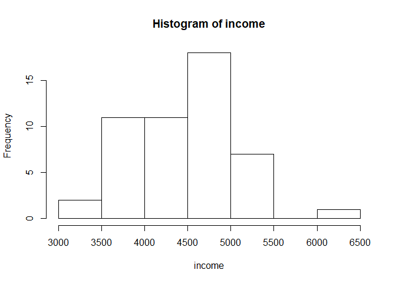
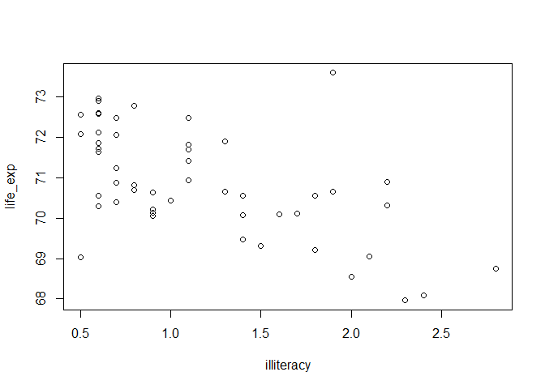
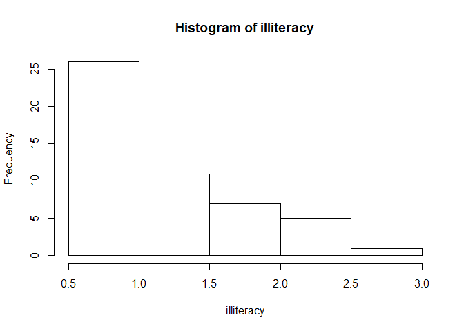
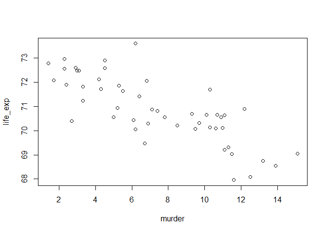
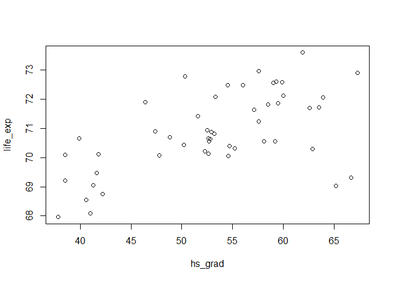
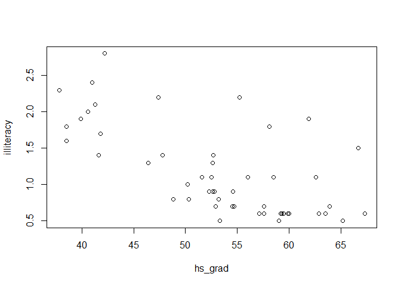
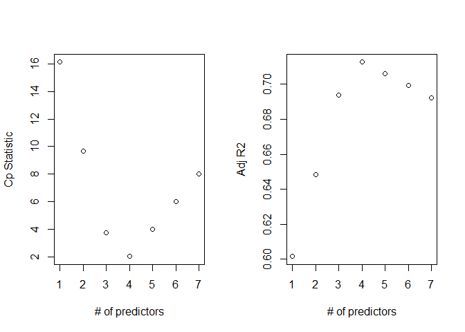

P8130 Biostats Methods Homework 5
================
Alison Elgass

``` r
library(tidyverse)
```

    ## -- Attaching packages ------------------------------------ tidyverse 1.2.1 --

    ## v ggplot2 3.2.1     v purrr   0.3.2
    ## v tibble  2.1.3     v dplyr   0.8.3
    ## v tidyr   1.0.0     v stringr 1.4.0
    ## v readr   1.3.1     v forcats 0.4.0

    ## -- Conflicts --------------------------------------- tidyverse_conflicts() --
    ## x dplyr::filter() masks stats::filter()
    ## x dplyr::lag()    masks stats::lag()

``` r
library(dplyr)
library(faraway)
library(broom)
library(purrr)
```

# Problem 1

``` r
states = as_tibble(state.x77) %>% janitor::clean_names()
```

## Part a

``` r
summary(states)
```

    ##    population        income       illiteracy       life_exp    
    ##  Min.   :  365   Min.   :3098   Min.   :0.500   Min.   :67.96  
    ##  1st Qu.: 1080   1st Qu.:3993   1st Qu.:0.625   1st Qu.:70.12  
    ##  Median : 2838   Median :4519   Median :0.950   Median :70.67  
    ##  Mean   : 4246   Mean   :4436   Mean   :1.170   Mean   :70.88  
    ##  3rd Qu.: 4968   3rd Qu.:4814   3rd Qu.:1.575   3rd Qu.:71.89  
    ##  Max.   :21198   Max.   :6315   Max.   :2.800   Max.   :73.60  
    ##      murder          hs_grad          frost             area       
    ##  Min.   : 1.400   Min.   :37.80   Min.   :  0.00   Min.   :  1049  
    ##  1st Qu.: 4.350   1st Qu.:48.05   1st Qu.: 66.25   1st Qu.: 36985  
    ##  Median : 6.850   Median :53.25   Median :114.50   Median : 54277  
    ##  Mean   : 7.378   Mean   :53.11   Mean   :104.46   Mean   : 70736  
    ##  3rd Qu.:10.675   3rd Qu.:59.15   3rd Qu.:139.75   3rd Qu.: 81163  
    ##  Max.   :15.100   Max.   :67.30   Max.   :188.00   Max.   :566432

``` r
attach(states)
```

    ## The following object is masked from package:tidyr:
    ## 
    ##     population

## Part b

``` r
#par(mfrow=c(1,1))
plot(income, life_exp) #some + linear
```

<!-- -->

``` r
hist(income)
```

<!-- -->

``` r
plot(illiteracy, life_exp) #linear -, outliers
```

<!-- -->

``` r
hist(illiteracy)
```

<!-- -->

``` r
plot(murder, life_exp) #linear -
```

<!-- -->

``` r
plot(hs_grad, life_exp) #linear +, outliers
```

<!-- -->

## Part c

### backward elimination

``` r
#fit regression model with all predictors
mult.fit <- lm(life_exp ~ ., data = states)
tidy(mult.fit)
```

    ## # A tibble: 8 x 5
    ##   term             estimate  std.error statistic  p.value
    ##   <chr>               <dbl>      <dbl>     <dbl>    <dbl>
    ## 1 (Intercept) 70.9          1.75         40.6    2.51e-35
    ## 2 population   0.0000518    0.0000292     1.77   8.32e- 2
    ## 3 income      -0.0000218    0.000244     -0.0892 9.29e- 1
    ## 4 illiteracy   0.0338       0.366         0.0923 9.27e- 1
    ## 5 murder      -0.301        0.0466       -6.46   8.68e- 8
    ## 6 hs_grad      0.0489       0.0233        2.10   4.20e- 2
    ## 7 frost       -0.00574      0.00314      -1.82   7.52e- 2
    ## 8 area        -0.0000000738 0.00000167   -0.0443 9.65e- 1

``` r
#eliminate variables by highest p-val
step1 = update(mult.fit, . ~ . -area)
tidy(step1)
```

    ## # A tibble: 7 x 5
    ##   term          estimate std.error statistic  p.value
    ##   <chr>            <dbl>     <dbl>     <dbl>    <dbl>
    ## 1 (Intercept) 71.0       1.39        51.2    3.69e-40
    ## 2 population   0.0000519 0.0000288    1.80   7.85e- 2
    ## 3 income      -0.0000244 0.000234    -0.104  9.17e- 1
    ## 4 illiteracy   0.0285    0.342        0.0833 9.34e- 1
    ## 5 murder      -0.302     0.0433      -6.96   1.45e- 8
    ## 6 hs_grad      0.0485    0.0207       2.35   2.37e- 2
    ## 7 frost       -0.00578   0.00297     -1.94   5.84e- 2

``` r
step2 = update(step1, . ~ . -illiteracy)
tidy(step2)
```

    ## # A tibble: 6 x 5
    ##   term          estimate std.error statistic  p.value
    ##   <chr>            <dbl>     <dbl>     <dbl>    <dbl>
    ## 1 (Intercept) 71.1       1.03         69.1   1.66e-46
    ## 2 population   0.0000511 0.0000271     1.89  6.57e- 2
    ## 3 income      -0.0000248 0.000232     -0.107 9.15e- 1
    ## 4 murder      -0.300     0.0370       -8.10  2.91e-10
    ## 5 hs_grad      0.0478    0.0186        2.57  1.37e- 2
    ## 6 frost       -0.00591   0.00247      -2.39  2.10e- 2

``` r
step3 = update(step2, . ~ . -income)
tidy(step3) #R2 =0.736, R2adj = 0.7126
```

    ## # A tibble: 5 x 5
    ##   term          estimate std.error statistic  p.value
    ##   <chr>            <dbl>     <dbl>     <dbl>    <dbl>
    ## 1 (Intercept) 71.0       0.953         74.5  8.61e-49
    ## 2 population   0.0000501 0.0000251      2.00 5.20e- 2
    ## 3 murder      -0.300     0.0366        -8.20 1.77e-10
    ## 4 hs_grad      0.0466    0.0148         3.14 2.97e- 3
    ## 5 frost       -0.00594   0.00242       -2.46 1.80e- 2

``` r
step4 = update(step3, . ~ . -population) #close, p-val = 0.052
tidy(step4) #R2 =0.713, R2adj = 0.694  LOWER
```

    ## # A tibble: 4 x 5
    ##   term        estimate std.error statistic  p.value
    ##   <chr>          <dbl>     <dbl>     <dbl>    <dbl>
    ## 1 (Intercept) 71.0       0.983       72.2  5.25e-49
    ## 2 murder      -0.283     0.0367      -7.71 8.04e-10
    ## 3 hs_grad      0.0499    0.0152       3.29 1.95e- 3
    ## 4 frost       -0.00691   0.00245     -2.82 6.99e- 3

The step3 model includes: population, murder, hs\_grad, frost  
The p-value in this model for population is 0.052.  
Since this is close to the often-used 0.05 threshold, we check the model
if population is additonally removed.

This step4 model includes: murder, hs\_grad, frost  
However this model has a slightly lower R<sup>2</sup> (0.713 vs. 0.736)
and R<sup>2</sup> adjusted (0.694 vs. 0.713), so I would go with the
step3 model which includes population.

### forward elimination

``` r
#function to nicely extract p-value of last variable from broom::tidy
pvals = function(fitn) {
  p = tidy(fitn)$p.value[nrow(tidy(fitn))]
  p
}

#0. start with single variables
fit1 = lm(life_exp ~ population, data = states)
fit2 = lm(life_exp ~ income, data = states)
fit3 = lm(life_exp ~ illiteracy, data = states)
fit4 = lm(life_exp ~ murder, data = states)
fit5 = lm(life_exp ~ hs_grad, data = states)
fit6 = lm(life_exp ~ frost, data = states)
fit7 = lm(life_exp ~ area, data = states)

fits = tibble(fit1, fit2, fit3, fit4, fit5, fit6, fit7)
map(.x = fits, ~ pvals(.x)) #get all p-values
```

    ## $fit1
    ## [1] 0.6386594
    ## 
    ## $fit2
    ## [1] 0.01561728
    ## 
    ## $fit3
    ## [1] 6.96925e-06
    ## 
    ## $fit4
    ## [1] 2.26007e-11
    ## 
    ## $fit5
    ## [1] 9.196096e-06
    ## 
    ## $fit6
    ## [1] 0.0659874
    ## 
    ## $fit7
    ## [1] 0.4581464

``` r
#1. lowest p-val = murder (fit4)
forward1 = lm(life_exp ~ murder, data = states)
# update forward1 by trying to add each other predictor
fit1 = update(forward1, . ~ . +population)
fit2 = update(forward1, . ~ . +income)
fit3 = update(forward1, . ~ . +illiteracy)
fit4 = update(forward1, . ~ . +hs_grad)
fit5 = update(forward1, . ~ . +frost)
fit6 = update(forward1, . ~ . +area)

fits = tibble(fit1, fit2, fit3, fit4, fit5, fit6)
map(.x = fits, ~ pvals(.x)) #get all p-values
```

    ## $fit1
    ## [1] 0.0163694
    ## 
    ## $fit2
    ## [1] 0.06663619
    ## 
    ## $fit3
    ## [1] 0.5429104
    ## 
    ## $fit4
    ## [1] 0.009088366
    ## 
    ## $fit5
    ## [1] 0.03520523
    ## 
    ## $fit6
    ## [1] 0.4243751

``` r
#2. next lowest p-val = hs grad (fit4)
forward2 = update(forward1, . ~ . +hs_grad)
# update forward2 by trying to add each other predictor
fit1 = update(forward2, . ~ . +population)
fit2 = update(forward2, . ~ . +income)
fit3 = update(forward2, . ~ . +illiteracy)
fit4 = update(forward2, . ~ . +frost)
fit5 = update(forward1, . ~ . +area)

fits = tibble(fit1, fit2, fit3, fit4, fit5)
map(.x = fits, ~ pvals(.x)) #get all p-values
```

    ## $fit1
    ## [1] 0.01994926
    ## 
    ## $fit2
    ## [1] 0.6924184
    ## 
    ## $fit3
    ## [1] 0.4094209
    ## 
    ## $fit4
    ## [1] 0.006987727
    ## 
    ## $fit5
    ## [1] 0.4243751

``` r
#3. next lowest p-val = frost (fit4)
forward3 = update(forward2, . ~ . +frost)
# update forward3 by trying to add each other predictor
fit1 = update(forward3, . ~ . +population)
fit2 = update(forward3, . ~ . +income)
fit3 = update(forward3, . ~ . +illiteracy)
fit4 = update(forward3, . ~ . +area)

fits = tibble(fit1, fit2, fit3, fit4)
map(.x = fits, ~ pvals(.x)) #no significant p-values
```

    ## $fit1
    ## [1] 0.05200514
    ## 
    ## $fit2
    ## [1] 0.571031
    ## 
    ## $fit3
    ## [1] 0.5823608
    ## 
    ## $fit4
    ## [1] 0.8317269

``` r
#close though- adding population (fit1) p-value = 0.052

summary(forward3) #no population, R2adj = 0.69
```

    ## 
    ## Call:
    ## lm(formula = life_exp ~ murder + hs_grad + frost, data = states)
    ## 
    ## Residuals:
    ##     Min      1Q  Median      3Q     Max 
    ## -1.5015 -0.5391  0.1014  0.5921  1.2268 
    ## 
    ## Coefficients:
    ##              Estimate Std. Error t value Pr(>|t|)    
    ## (Intercept) 71.036379   0.983262  72.246  < 2e-16 ***
    ## murder      -0.283065   0.036731  -7.706 8.04e-10 ***
    ## hs_grad      0.049949   0.015201   3.286  0.00195 ** 
    ## frost       -0.006912   0.002447  -2.824  0.00699 ** 
    ## ---
    ## Signif. codes:  0 '***' 0.001 '**' 0.01 '*' 0.05 '.' 0.1 ' ' 1
    ## 
    ## Residual standard error: 0.7427 on 46 degrees of freedom
    ## Multiple R-squared:  0.7127, Adjusted R-squared:  0.6939 
    ## F-statistic: 38.03 on 3 and 46 DF,  p-value: 1.634e-12

``` r
summary(fit1) #population added, R2dj = 0.71
```

    ## 
    ## Call:
    ## lm(formula = life_exp ~ murder + hs_grad + frost + population, 
    ##     data = states)
    ## 
    ## Residuals:
    ##      Min       1Q   Median       3Q      Max 
    ## -1.47095 -0.53464 -0.03701  0.57621  1.50683 
    ## 
    ## Coefficients:
    ##               Estimate Std. Error t value Pr(>|t|)    
    ## (Intercept)  7.103e+01  9.529e-01  74.542  < 2e-16 ***
    ## murder      -3.001e-01  3.661e-02  -8.199 1.77e-10 ***
    ## hs_grad      4.658e-02  1.483e-02   3.142  0.00297 ** 
    ## frost       -5.943e-03  2.421e-03  -2.455  0.01802 *  
    ## population   5.014e-05  2.512e-05   1.996  0.05201 .  
    ## ---
    ## Signif. codes:  0 '***' 0.001 '**' 0.01 '*' 0.05 '.' 0.1 ' ' 1
    ## 
    ## Residual standard error: 0.7197 on 45 degrees of freedom
    ## Multiple R-squared:  0.736,  Adjusted R-squared:  0.7126 
    ## F-statistic: 31.37 on 4 and 45 DF,  p-value: 1.696e-12

We run into the same close call with population. The forward3 model
includes murder, hs grad, and frost; the p-value for population is
0.052. Again though the model with population included has a higher
R<sup>2</sup> so I choose to go with this one.

The subset includes murder, hs\_grad, frost, and population.

### illiteracy vs. hs graduation rate

``` r
plot(hs_grad, illiteracy)
```

<!-- --> There
appears to be a very weak negative relationship (higher graduation rates
correlate with lower illiteracy rates aka higher literacy). The subset
includes only hs\_grad rate.

## Part d

``` r
aa = leaps::regsubsets(life_exp ~ ., data=states)
bb = summary(aa)

par(mfrow=c(1,2))
plot(1:7, bb$cp, xlab="# of predictors", ylab="Cp Statistic")
plot(1:7, bb$adjr2, xlab="# of predictors", ylab="Adj R2")
```

<!-- -->

These plots indicate 4 predictors is optimal, with the lowest
C<sub>p</sub> and highest adjusted R<sup>2</sup>.

## Part e

My final model, then, would include the following 4 predictors: murder,
hs graduation rate, frost, and population.

``` r
final = lm(life_exp ~ murder + hs_grad + frost + population)
summary(final)
```

    ## 
    ## Call:
    ## lm(formula = life_exp ~ murder + hs_grad + frost + population)
    ## 
    ## Residuals:
    ##      Min       1Q   Median       3Q      Max 
    ## -1.47095 -0.53464 -0.03701  0.57621  1.50683 
    ## 
    ## Coefficients:
    ##               Estimate Std. Error t value Pr(>|t|)    
    ## (Intercept)  7.103e+01  9.529e-01  74.542  < 2e-16 ***
    ## murder      -3.001e-01  3.661e-02  -8.199 1.77e-10 ***
    ## hs_grad      4.658e-02  1.483e-02   3.142  0.00297 ** 
    ## frost       -5.943e-03  2.421e-03  -2.455  0.01802 *  
    ## population   5.014e-05  2.512e-05   1.996  0.05201 .  
    ## ---
    ## Signif. codes:  0 '***' 0.001 '**' 0.01 '*' 0.05 '.' 0.1 ' ' 1
    ## 
    ## Residual standard error: 0.7197 on 45 degrees of freedom
    ## Multiple R-squared:  0.736,  Adjusted R-squared:  0.7126 
    ## F-statistic: 31.37 on 4 and 45 DF,  p-value: 1.696e-12

Life expectancy = 71.03 - 0.3X<sub>murder</sub> +
0.00466X<sub>grad</sub> - 0.00594X<sub>frost</sub> +
0.00005X<sub>population</sub>

## Part f

I would conclude that life expectancy can be predicted best by these
variables. Increasing murder rates and frost have a negative effect on
life expectancy; for example, we would expect a 1% increase in murder
rate to result in a decrease of 0.3 years of life expectancy.
Oppositely, high school graduation rate and population have a positive
association with life expectancy, though population was a tough call
since it may or may not be significant. Overall this model is based only
on the data given, which means it’s limited in its predictive ability
and generalizability, especially since the data is ecological.

# Problem 2

``` r
properties = read_csv("./CommercialProperties.csv")
```

    ## Parsed with column specification:
    ## cols(
    ##   Rental_rate = col_double(),
    ##   Age = col_double(),
    ##   Taxes = col_double(),
    ##   Vacancy_rate = col_double(),
    ##   Sq_footage = col_double()
    ## )
